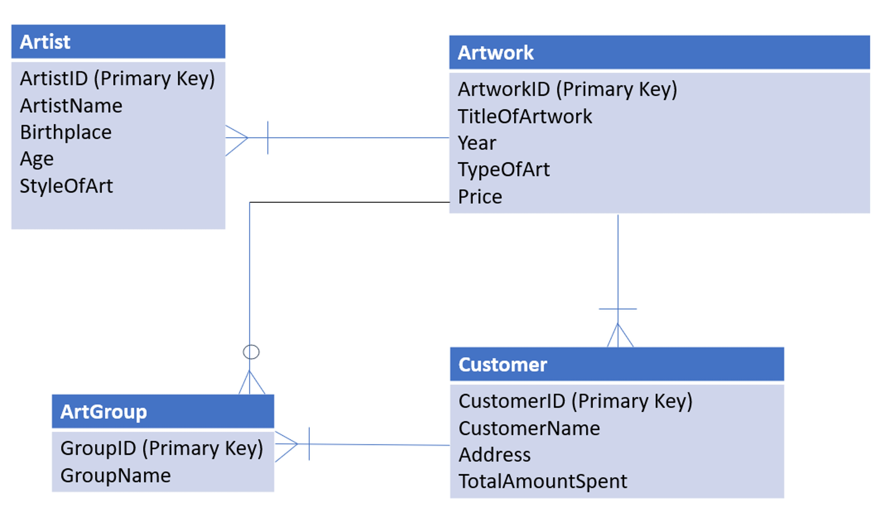

# ArtBase Database Management System


## Overview
The ArtBase Database Management System is designed to manage artworks, artists, and customer data for an art gallery. This project demonstrates key database concepts including entity-relationship modeling, relational schema design, normalization, and SQL-based data operations.

The system ensures efficient data organization, reduces redundancy, and enables structured data retrieval for business use.

## Problem Statement
Art galleries handle large volumes of data related to artworks, artists, and customers. Managing this data manually can lead to inefficiencies, redundancy, and inconsistency.

This project aims to:
- Organize data in a structured format  
- Maintain relationships between entities  
- Ensure data consistency and integrity  
- Enable efficient data retrieval  

## Tools & Technologies
- SQL  
- Database Design (ER Modeling)  
- Relational Schema Design  
- Normalization (1NF, 2NF, 3NF)  

## Database Design

### Entities
- Artist  
- Artwork  
- Art Group  
- Customer  

### Relationships
- Artist → Artwork (One-to-Many)  
- Artwork → Art Group (Many-to-One)  
- Customer → Artwork (One-to-Many)  

## ER Diagram


## Schema Structure
- Artist (ArtistID, Name, Style, Age, Birthplace)  
- Artwork (ArtworkID, Title, Year, Type, Price, ArtistID, GroupID)  
- ArtGroup (GroupID, GroupName)  
- Customer (CustomerID, Name, Address, TotalSpent)  

## Features
- Relational database design with multiple interconnected entities  
- Normalization up to Third Normal Form (3NF)  
- Defined primary and foreign key relationships  
- SQL-based operations including:
  - Data insertion  
  - Data retrieval  
  - Joins across tables  
  - Data updates and deletion  

## Sample SQL Query
```sql
SELECT a.Title, ar.Name
FROM Artwork a
JOIN Artist ar ON a.ArtistID = ar.ArtistID

## Project Workflow
Requirement Analysis → ER Modeling → Schema Design → Normalization → SQL Implementation → Testing

## Business Impact
- Improves data organization and accessibility  
- Reduces redundancy and inconsistency  
- Enables efficient querying and reporting  
- Supports better decision-making in art gallery operations  

## Project Files
- project_report.pdf (includes full SQL queries and implementation)  
- er_diagram.png  

## Note
SQL queries and implementation details are included in the project report. A complete SQL script file will be added in the future.

## Future Improvements
- Add SQL script file (.sql)  
- Build frontend interface for database interaction  
- Add advanced queries and analytics  
- Deploy database on cloud platforms  

## Author
Rinku Patel  
Data Analyst | SQL | Python | Power BI | Tableau  
